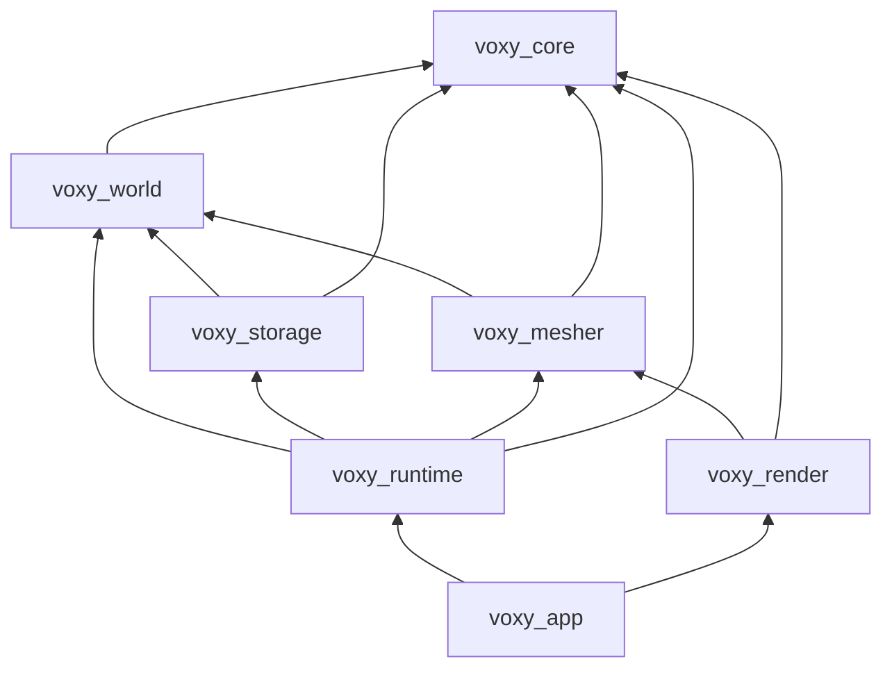
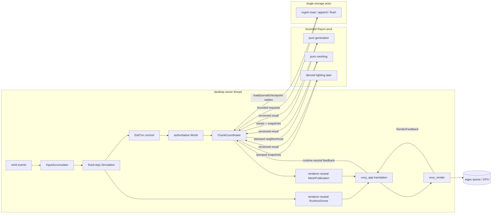

# Архитектура Voxy

Статус: архитектурный baseline для реализации V1 на Rust

Дата: 2026-09-02

Связанное решение: [ADR 0001](adr/0001-engine-foundation.md)

## 1. Reference profile

Поскольку репозиторий был пуст и продуктовые требования ещё не заданы, архитектура опирается на явный профиль. Это не скрытые предположения: изменение любого пункта ниже требует короткого ADR до реализации затронутой подсистемы.

- Нативный desktop-клиент для macOS, Windows и Linux.
- Блочные осево-ориентированные воксели размером в одну world unit.
- Большой процедурно генерируемый мир, редактирование во время игры и надёжное сохранение.
- Single-player vertical slice первым; headless server и server-authoritative multiplayer возможны позже.
- Rust stable, edition 2024; точные версии toolchain и crates фиксируются в Phase 0.
- `wgpu` как portable GPU API и `winit` как platform event loop.
- Базовая цель клиента — 60 fps. До появления benchmark scene это цель, а не подтверждённая характеристика.

### Главный decision gate

V1 хранит `BlockStateId` на ячейку. Это подходит для Minecraft-подобного block world. Smooth terrain с density field, Marching Cubes или Dual Contouring требует другого sample type, более широкого halo, seam policy и collision representation. Его нельзя «добавить флагом» после стабилизации save format.

Если smooth/SDF — реальная цель продукта, надо заменить это решение до реализации `voxy_world`. Остальная архитектура — ownership, streaming, stamped jobs, persistence actor, camera-relative rendering — в основном сохранится.

## 2. Цели и не-цели V1

### Цели

1. Корректность координат, edits и сохранения важнее ранних микрооптимизаций.
2. Ни один frame не обязан выполнить неограниченное число completions, generation jobs или uploads.
3. Мир можно читать параллельно без блокировки authoritative mutation.
4. Generation и meshing детерминированы входными данными и тестируются вне GPU/window.
5. Renderer переживает resize, suspend и surface recreation, не владея gameplay state.
6. Внутренние структуры не протекают в disk или будущий network protocol.
7. Любое решение об ускорении принимается после trace/benchmark, сохраняя стабильные контракты между стадиями.

### Не-цели

- smooth voxels/SDF в том же формате мира;
- браузер/WebAssembly-клиент;
- сетевой transport и client prediction в первом vertical slice;
- native dynamic-library plugins;
- общий-purpose render graph;
- GPU meshing, sparse voxel octree, Hi-Z и clipmap LOD до профилирования;
- гарантированный bitwise-deterministic floating-point physics между платформами.

## 3. Архитектурные инварианты

1. **Single writer:** только owner/tick thread меняет `World`, `Simulation` и lifecycle slots.
2. **Immutable work inputs:** worker получает `Arc` snapshots и value-type config, но не ссылку на mutable world.
3. **Versioned results:** load, generation, lighting и meshing возвращают ticket/stamp; stale result отбрасывается на apply barrier.
4. **Missing is data:** `Unloaded` не равен `Air`. Политику выбирает конкретный consumer.
5. **Bounded work:** каждая очередь, число in-flight tasks, RAM/GPU residency и per-frame apply имеют лимит.
6. **Derived stays derived:** mesh, light cache, visibility и GPU allocations можно пересоздать из canonical chunks.
7. **Stable persistence:** save/wire DTO версионирован и не является дампом Rust memory layout.
8. **Camera-relative floats:** глобальные координаты не преобразуются напрямую в `f32`.
9. **Explicit dependency direction:** platform/GPU не импортируются world/storage/mesher слоями.
10. **Failure containment:** повреждённый chunk, shader или surface не должен превращаться в скрытую порчу authoritative world.

## 4. Workspace и зависимости



| Crate | Ответственность | Не должен знать |
|---|---|---|
| `voxy_core` | coordinate/value types, IDs, tick values, cooperative cancellation/byte-permit primitives | filesystem, `wgpu`, `winit`, game state |
| `voxy_world` | block registry, palette chunks, reads, transactions, revisions, generation port | GPU, window, region files |
| `voxy_storage` | versioned codec, region store, recovery, I/O actor | renderer, simulation rules |
| `voxy_mesher` | pure neighborhood-to-quads transformation | GPU objects, mutable world, disk |
| `voxy_runtime` | fixed ticks, authoritative world, streaming coordinator, job dispatch, renderer-neutral mesh publications | `winit`, `wgpu`, surface/swapchain |
| `voxy_render` | `wgpu` device/queue/surface lifecycle, mesh residency, passes, culling | world mutation, save files |
| `voxy_app` | `winit::ApplicationHandler`, input/lifecycle glue, composition root | canonical domain logic |

Правило зависимостей проверяется не интерфейсами ради интерфейсов, а crate graph. Traits вводятся только на настоящих заменяемых границах: generator, storage actor backend, clock/test executor. В hot path используются concrete types и generics, а не повсеместный `dyn Trait`.

Первичный набор внешних crates:

- `wgpu`, `winit` — GPU и platform shell;
- `glam` — float/vector math; integer world coordinates остаются собственными newtypes;
- `rayon` — выделенный CPU pool для конечных pure jobs;
- bounded channel crate (`crossbeam-channel` либо эквивалент, выбор фиксируется в Phase 0);
- `serde` только на config/явных DTO, не на внутренних structs по умолчанию;
- `tracing`, `thiserror`; `anyhow` разрешён только в binary/composition root;
- `bytemuck` только для явно проверенных GPU POD structs;
- `proptest` и benchmark harness в dev dependencies.

Tokio не нужен для generation или meshing. Если позже появится networking, его runtime живёт в отдельном service boundary; CPU-bound work всё равно идёт через контролируемый CPU pool.

## 5. Каноническая модель мира

### 5.1 Координаты

```rust
pub const CHUNK_EDGE: i64 = 32;

#[derive(Clone, Copy, Eq, PartialEq, Ord, PartialOrd, Hash)]
pub struct VoxelPos {
    pub x: i64,
    pub y: i64,
    pub z: i64,
}

#[derive(Clone, Copy, Eq, PartialEq, Ord, PartialOrd, Hash)]
pub struct ChunkPos {
    pub x: i64,
    pub y: i64,
    pub z: i64,
}

#[derive(Clone, Copy, Eq, PartialEq)]
pub struct LocalPos {
    x: u8,
    y: u8,
    z: u8,
}

#[repr(transparent)]
pub struct LocalIndex(u16); // checked: 0..32^3

pub fn split_voxel(pos: VoxelPos) -> (ChunkPos, LocalPos);

pub fn join_voxel(chunk: ChunkPos, local: LocalPos)
    -> Result<VoxelPos, CoordinateOverflow>;
```

`split_voxel` использует только `div_euclid`/`rem_euclid`; пары около `-1`, `-32`, `-33`, нуля и границ `i64` обязательны в property tests. AABB в data layer всегда полуоткрытый: `[min, max)`. Linear layout V1 фиксируется как `x + 32 * (z + 32 * y)`. Обратное преобразование chunk/local в voxel использует checked multiply/add и возвращает ошибку, а не wrap.

Поля `LocalPos` private; единственный constructor проверяет каждую компоненту `< 32`. Linear index считается после widening в `usize`, а decoder не создаёт эти newtypes без validation.

Для dynamic objects используется нормализованная позиция:

```rust
pub struct WorldPoint {
    pub anchor: ChunkPos,
    pub local: glam::DVec3, // каждая компонента нормализована в [0, CHUNK_EDGE)
}
```

Renderer передаёт camera anchor отдельно и строит `f32` position только из разности близких chunk coordinates плюс local offset. Это устраняет jitter далеко от origin без переноса canonical world.

### 5.2 Blocks и registry

```rust
#[repr(transparent)]
pub struct BlockStateId(u32); // dense runtime ID, AIR == 0

#[repr(transparent)]
pub struct WorldStateId(u32); // append-only ID внутри конкретного мира

pub struct BlockDef {
    pub key: ResourceKey,       // например, "voxy:stone"
    pub render: RenderKind,     // Invisible | Opaque | Cutout | Translucent
    pub occlusion: Occlusion,
    pub collision: CollisionShape,
    pub face_materials: [MaterialId; 6],
    pub translucent_interface_group: Option<InterfaceGroupId>,
    pub emission: u8,
}
```

`BlockStateId` оптимален для hot path, но нестабилен между sessions/content packs. Immutable session `BlockRegistry` хранит definitions и mapping content state → dense runtime ID. Отдельная mutable append-only `WorldStateTable` в manifest/WAL хранит `WorldStateId -> ResourceKey + state properties`, а disk chunk palettes содержат `WorldStateId`. При загрузке table + registry remap-ят их в `BlockStateId`; новые world IDs journaled до commit, который на них ссылается. Для каждого неизвестного `WorldStateId` создаётся отдельный placeholder `BlockStateId`: render definition у них может быть общей, но обратное отображение остаётся injective и full-post-image save не теряет исходную identity. ID никогда молча не переиспользуется.

Definitions в `BlockRegistry` immutable в течение session V1; добавление `WorldStateId` для уже известного state меняет только `WorldStateTable` и не увеличивает `RegistryEpoch`. Если позже понадобится hot reload definitions, он создаёт новый `RegistryEpoch`; все зависящие mesh/light results получают этот epoch в stamp. `translucent_interface_group` — typed identity среды (например, одного water state family): она используется только directional face classifier-ом и не подменяется совпадением texture/material ID.

### 5.3 Chunk storage

```rust
pub struct ChunkData {
    pub blocks: PalettedBlocks,
    pub block_data: SparseBlockData,
}

pub enum PalettedBlocks {
    Uniform(BlockStateId),
    Packed {
        bits_per_index: u8,
        palette: Box<[BlockStateId]>,
        words: Box<[u64]>,
    },
    Direct(Box<[BlockStateId]>), // длина всегда 32^3
}

#[derive(Clone, Copy, Eq, PartialEq, Ord, PartialOrd)]
pub struct ChunkRevision(u64);

pub struct ChunkSnapshot {
    pub pos: ChunkPos,
    pub revision: ChunkRevision,
    pub data: Arc<ChunkData>,
}
```

32³ содержит 32 768 ячеек. Direct `u32` занимает 128 KiB без metadata; 4-bit local palette — 16 KiB плюс сама palette. `Uniform` хранит один ID. Representation выбирается автоматически после commit/load, но hysteresis не даёт chunk постоянно перескакивать между formats из-за одного изменения. Перед persistent encoding palette нормализуется по `WorldStateId`, поэтому одинаковая решётка получает одинаковый canonical payload независимо от истории edits.

Mesh, lighting, height summaries, GPU handles и LRU state не входят в `ChunkData`. Derived caches имеют собственные source stamps.

### 5.4 Read contract

```rust
pub enum Sample<T> {
    Loaded(T),
    Unloaded { chunk: ChunkPos },
    Unavailable { chunk: ChunkPos, cause: ChunkFailureKind },
}

pub trait VoxelView {
    fn sample(&self, pos: VoxelPos) -> Sample<BlockStateId>;
    fn chunk(&self, pos: ChunkPos) -> Option<ChunkSnapshot>;
}
```

Consumers выбирают разные безопасные semantics:

- renderer может временно показать boundary face, интерпретировав missing halo как air, но stamp содержит `None` и появление соседа обязательно вызывает remesh;
- collision считает missing boundary непроходимой либо останавливает sweep;
- raycast возвращает `Unloaded`, а не ложный miss;
- `Unavailable` означает quarantine/permanent failure, отображается и диагностируется отдельно; consumer не запускает бесконечный streaming retry;
- generator никогда не читает порядок уже загруженных chunks как источник истины.

### 5.5 Atomic edit transactions

Все edits проходят через owner thread:

```rust
pub struct EditTxn {
    pub source: EditSource,
    pub expected: Vec<(ChunkPos, ChunkRevision)>,
    pub writes: Vec<VoxelWrite>,
}

pub struct CommitReceipt {
    pub tick: TickId,
    pub commit: CommitId,
    pub chunks: Vec<ChunkDelta>,
    pub inverse: InverseEdit,
    pub durability: DurabilityTicket,
}

impl World {
    pub fn commit(&mut self, txn: EditTxn)
        -> Result<CommitReceipt, CommitError>;
}
```

Commit делает следующее как одну логическую операцию:

1. проверяет bounds, registry IDs, loaded state и ожидаемые revisions;
2. сортирует writes по chunk/local index и отклоняет duplicate targets; вызывающий bulk tool обязан нормализовать их заранее;
3. строит новые immutable `ChunkData` для затронутых chunks;
4. увеличивает каждую revision ровно один раз;
5. создаёт inverse/delta;
6. отмечает save dirty;
7. публикует `ChunkChanged` с dirty AABB и boundary mask.

Изменение на грани/ребре/углу инвалидирует mesh соседей, которым нужна эта ячейка для visibility/AO. Маска умеет адресовать все 26 направлений halo: один corner voxel затрагивает до семи соседних meshes, а batch по нескольким boundaries может затронуть все 26.

Одна transaction имеет предел числа writes и затронутых chunks. Большие операции editor/importer дробятся на явно обозначенные batches с progress/cancel; иначе один edit способен заморозить frame.

## 6. Runtime и модель конкурентности

### 6.1 Владение потоками

| Execution domain | Владеет | Не делает |
|---|---|---|
| Owner/tick thread | `Simulation`, `World`, `ChunkCoordinator`, lifecycle state | blocking disk I/O, тяжёлый meshing/generation |
| Desktop app thread | `winit` loop, input accumulator, `Renderer`; в V1 совпадает с owner thread | произвольные background callbacks |
| Dedicated Rayon pool | pure generation, meshing, compression-prep, позже lighting | world mutation, GPU calls, file ownership |
| Storage actor thread | открытые region files, append/flush/recovery/compaction | world/render mutation |
| GPU queue | submitted uploads/passes | canonical state |

Совпадение tick thread с desktop main thread — простейшая V1 topology. `voxy_runtime` при этом не импортирует `winit`/`wgpu`, поэтому headless binary сможет владеть тем же runtime на своём thread. Разделять client simulation и rendering на два threads следует только по профилю.

`WorldEpoch` — newtype из `voxy_core`, уникальный для каждого open/reset мира в процессе. Все asynchronous storage/CPU/render bridges несут epoch либо получают его через opaque permit; сообщение прошлого epoch никогда не применяется к новому миру. Счётчики, scoped этим epoch, проверяются на overflow и не wrap-ятся.

`Arc<Mutex<World>>` и `Arc<RwLock<Chunk>>` не являются escape hatch: они размывают transaction boundary и позволяют worker latency блокировать tick. Общими остаются только immutable `Arc<ChunkData>` и bounded mailboxes.



### 6.2 Frame/tick boundary

Simulation service не привязан к `RedrawRequested`. `winit` wake/proxy и `WaitUntil(next_tick_deadline)` вызывают maintenance даже при низком render FPS, occlusion или suspend. Есть два разных контура:

- simulation-critical load results/interest обслуживаются в начале каждого tick по детерминированным count+byte budgets;
- mesh, visible prefetch и GPU upload обслуживаются на render/maintenance path по count+byte+time budgets.

Упрощённый contract:

```rust
fn service_tick_deadline(&mut self, now: Instant) {
    let plan = self.clock.plan(now); // ничего ещё не вычитает
    let batch = plan.due.min(self.config.max_ticks_per_turn);

    for _ in 0..batch {
        let tick = self.clock.next_tick();
        self.runtime.apply_critical_completions(tick, self.budgets.tick_apply);
        self.runtime.maintain_simulation_interest(tick, self.budgets.tick_dispatch);
        let input = self.input.for_tick(tick);
        self.runtime.tick(tick, input);
        self.runtime.apply_barrier();
        self.clock.commit_executed(1);
    }

    if self.mode.is_client() {
        self.clock.client_discard_excess(self.config.max_client_debt);
    } else if self.clock.has_debt() {
        self.wake_immediately(); // bounded batch, но server ticks не теряются
    }

    self.drain_transport_into_pending_queues();
    self.service_control_and_gpu_maintenance();
}

fn redraw(&mut self, now: Instant) {
    self.runtime.apply_derived_completions(self.budgets.frame_apply);
    self.runtime.maintain_visible_streaming(self.budgets.frame_dispatch);
    self.bridge_mesh_publications_with_renderer_permits();
    self.renderer.upload_pending(self.budgets.upload);

    let runtime_scene = self.runtime.render_scene(self.clock.alpha(now));
    let render_scene = self.translate_scene_in_app(runtime_scene);
    let outcome = self.renderer.render(&render_scene);
    self.handle_render_outcome(outcome);
}
```

`drain_transport_into_pending_queues` забирает CPU/storage completions и control replies даже без redraw, но не применяет canonical state вне tick barrier: critical результаты остаются в детерминированной pending queue до начала следующего tick. `service_control_and_gpu_maintenance` при отсутствии redraw может применить derived results по отдельному count+byte+time slice, coalesce-нуть publications и poll-ить GPU, но не запускает gameplay systems. Coalesced `EventLoopProxy` wake вызывается при переходе mailbox из empty в non-empty, поэтому occlusion не останавливает прогресс storage/shutdown.

- Initial client tick rate: 60 Hz.
- `plan` только сообщает debt; только `commit_executed` удаляет реально выполненные ticks. Client discard — отдельная наблюдаемая операция. Headless server debt сохраняет, выполняет bounded batches и между ними обслуживает control/shutdown.
- Large wall-clock delta clamps только в client policy; discarded duration/ticks пишутся в `simulation_debt`/`sim_time_discarded`.
- Input edges и накопленный mouse delta сохраняются до следующего tick и целиком потребляются им; последующие catch-up ticks получают нулевые edges/delta, но тот же held/analog state.
- External results применяются только в barriers, поэтому system order воспроизводим.
- Structural commands валидируются и commit-ятся в конце tick; physics/query systems этого tick видят pre-commit state, а новое состояние — со следующего tick. Render publication можно построить сразу после commit.
- GPU pressure может уменьшать visible/prefetch radius, но не обязательный `simulation` radius; при нехватке canonical data movement блокируется безопасно и load priority растёт.

### 6.3 Разные виды сообщений

Не используется один глобальный «event bus». Контракты различают:

- **Intent** — внешнее намерение игрока/сети/мода (`MoveIntent`);
- **Command** — нормализованная валидируемая попытка изменить authoritative state (`PlaceBlock`);
- **Commit receipt** — success/conflict/rejection с фактически назначенным tick/revisions;
- **Domain event** — уже случившийся факт (`ChunksCommitted`, `ActorMoved`);
- **Derived delta** — обновление replica/cache (`MeshReady`, `ChunkEvicted`);
- **Effect request/result** — disk, future network или OS interaction.

Внутри одного tick events обычно являются локальными `Vec<T>` с явным порядком. Cross-thread channels — только bounded и typed.

External commands получают `(target_tick, source_id, source_sequence, command_id)` и применяются в этом стабильном порядке, а не в порядке прихода channel. Для каждого source хранится monotonic accepted/rejected sequence high-watermark и bounded receipt cache: duplicate в cache возвращает прежний receipt, более старый после eviction получает `DuplicateExpired` и никогда не применяется повторно. Late command V1 явно отклоняется с текущим tick, а не незаметно переносится. Accepted worker completions на barrier сортируются по `(job_class, chunk, ticket)`.

Если streaming readiness влияет на gameplay, replay использует один из двух явных режимов: (a) fixture заранее materializes и проверяет hash всех нужных canonical chunks; либо (b) запись содержит `ChunkBecameReady { tick, chunk, revision, payload_ref }` и deduplicated canonical payload/post-image. Playback заранее готовит payload и только на записанном tick публикует факт; live load/generation completions не имеют права самостоятельно менять readiness. Поэтому скорость конкретной машины не становится скрытым входом и replay не обещает сделать отсутствующий payload готовым задним числом.

Versioned replay содержит header с manifest/registry/generator/**budget-config** hashes, tick rate, RNG scheme и выбранный materialization mode, затем ticked normalized `ActionFrame`/external commands, accepted external facts и ожидаемые receipts. Receipt фиксирует также deterministic admission outcome (`Accepted`, conflict, duplicate, late либо budget/storage pressure rejection), поэтому backpressure не становится скрытым входом. Raw OS events не являются replay format. Live-тест может переставлять уже pending результаты внутри одного barrier; задержка результата через разные barriers закономерно меняет readiness fact и должна породить другую запись, а не тот же ожидаемый replay.

Canonical state hash использует stable encoding, сортирует chunks/actors/IDs, включает authoritative RNG state и исключает meshes, queues, wall clock и caches. `HashMap` iteration не влияет на bytes; `f64` values запрещают NaN и нормализуют `-0.0`. Cross-platform float lockstep всё равно не обещается — hash equality является client/headless regression contract на заявленной platform/toolchain matrix.

### 6.4 CPU jobs

Coordinator хранит priority queues и передаёт в Rayon только ограниченное число задач — примерно active workers плюс малый slack. Таким образом внутренняя очередь Rayon не становится скрытым unbounded backlog.

```rust
pub struct JobTicket {
    pub world_epoch: WorldEpoch,
    pub chunk: ChunkPos,
    pub slot_generation: u64,
    pub intent_epoch: u64,
}

pub enum CpuResult {
    Generated {
        ticket: JobTicket,
        chunk: GeneratedChunk,
    },
    Meshed {
        ticket: JobTicket,
        stamp: MeshStamp,
        mesh: ChunkMesh,
    },
    Failed {
        ticket: JobTicket,
        class: JobClass,
        failure: JobFailure,
    },
}
```

Priority key начинается с work class (`SimulationCritical`, `Visible`, `Prefetch`), затем учитывает distance и age, чтобы дальняя задача не голодала бесконечно. Generation, mesh и save-prep имеют отдельные in-flight quotas. До dispatch coordinator резервирует count **и byte permit** для input/scratch/output; permit живёт до apply/drop. Builder прекращает работу с `OutputLimit`, если результат превышает reservation, а не создаёт memory spike.

`CancelToken` — маленький primitive из `voxy_core`, поэтому world/mesher не зависят от runtime. Cancellation cooperative: token проверяется между generation stages/mesh slices. Уже выполненный stale result безопасно отбрасывается. Ожидаемая ошибка становится `CpuResult::Failed`; пойманная invariant panic также публикует failure, но дополнительно помечает subsystem unhealthy и прекращает новые jobs этого class до controlled shutdown/recovery. Продолжать как после обычной ошибки небезопасно.

### 6.5 Mailboxes, wake и shutdown

`bounded` означает не только capacity, но и политику при заполнении:

- CPU completion slot/bytes резервируются до dispatch; worker использует `try_send`. Нарушение reservation становится observable failure, но worker никогда не ждёт owner бесконечно.
- Derived results coalesce по `(kind, chunk)` только по ordered `JobTicket::intent_epoch`/`MeshGeneration`; `MeshStamp` сравнивается на equality и не является временным watermark. Canonical commit/durability acknowledgments не droppable.
- Каждый storage request получает заранее зарезервированный terminal response slot либо one-shot mailbox; storage actor не блокируется на общей full result queue.
- Control/cancel/shutdown используют отдельный reserved path и не стоят за prefetch/load/compact bulk traffic, но durability fence не позволяет им обогнать уже принятые journal commits.
- GPU callback обновляет lossless atomic completion watermark и делает только best-effort coalesced wake.
- Background producer посылает coalesced `EventLoopProxy` wake; maintenance drain выполняется даже без redraw.
- Shutdown закрывает admission edits/jobs, поднимает cancellation, продолжает drain control/results и ждёт durability-fenced `ShutdownComplete`. Штатно конечные cooperative jobs после этого join-ятся. Гарантия bounded относится к очередям и корректным finite jobs: при global deadline зависший worker не join-ится бесконечно — app фиксирует неподтверждённые revisions/diagnostic и переходит в fail-stop process termination. Требование гарантированно вернуть управление даже при зависшем native job означает изоляцию такой работы в отдельный process.

Critical tick apply имеет стабильные count+byte limits; frame-derived apply добавляет time limit. `max messages` без byte permits не считается memory bound.

## 7. Chunk streaming

### 7.1 Ортогональные состояния

Один гигантский enum быстро порождает невозможные transitions. `ChunkSlot` хранит независимые axes:

```rust
pub struct ChunkSlot {
    pub slot_generation: u64,
    pub next_mesh_epoch: u64,
    pub demand: DemandState,
    pub content: ContentState,
    pub mesh: MeshState,
    pub persistence: PersistenceState,
    pub pins: PinCounts,
    pub last_used: TickId,
}

#[derive(Clone, Copy, Eq, PartialEq, Ord, PartialOrd)]
pub struct MeshGeneration {
    pub slot_generation: u64,
    pub mesh_epoch: u64,
}

pub struct MeshIntent {
    pub generation: MeshGeneration,
    pub stamp: MeshStamp,
}

pub enum ContentState {
    Absent,
    Loading(JobTicket),
    Generating(JobTicket),
    Ready(ChunkSnapshot),
    Failed(RetryState),
}

pub enum MeshState {
    None,
    Queued(MeshIntent),
    Building(MeshIntent),
    CpuReady(MeshIntent),
    Published(MeshIntent),
    Removing(MeshGeneration),
}

pub struct PersistenceState {
    pub content: ChunkRevision,
    pub journaled: ChunkRevision,
    pub checkpointed: ChunkRevision,
    pub journal_in_flight: Option<ChunkRevision>,
}
```

`content > journaled` означает недолговечное изменение; `journaled > checkpointed` означает, что WAL уже достаточен для recovery, но region ещё отстаёт. Watermarks монотонны и никогда не продвигаются дальше revision из конкретного acknowledgment.

`slot_generation` выдаётся monotonic `WorldEpoch`-scoped allocator-ом при каждом новом slot incarnation и не зависит от сохранения удалённой map entry; wrap запрещён. `next_mesh_epoch` увеличивается при каждом request/remove, а mesh-job `JobTicket::intent_epoch` равен назначенному epoch. Result/feedback применяется только при точном совпадении `MeshGeneration`; `MeshStamp` остаётся equality/source key.

GPU residency остаётся внутри renderer. Runtime знает только core-owned `MeshGeneration`; `voxy_app` переводит его в `MeshReplicaKey { pos, generation: ReplicaGeneration { ... } }` и обратно. Runtime получает принятие/удаление replica, а GPU handles/renderer types в `World` не попадают.

### 7.2 Interest sets

Один или несколько observers (player, editor camera, later server actors) создают четыре множества:

1. `simulation`: collision/raycast/gameplay должны иметь canonical data;
2. `visible`: chunks потенциально видимы camera;
3. `prefetch`: запас по прогнозируемому движению;
4. `halo`: соседи, нужные generation/meshing/lighting.

Радиусы и форма — config, а не константы архитектуры. Load/generation priority задаётся классом, frustum, distance, velocity lead и возрастом запроса. Добавление/удаление demand использует hysteresis, чтобы chunk на границе не thrash-ился каждый frame.

### 7.3 Backpressure и eviction

Обязательные budgets:

```rust
pub struct RuntimeBudgets {
    pub resident_chunk_bytes: usize,
    pub cpu_job_reserved_bytes: usize,
    pub pending_mesh_publication_bytes: usize,
    pub max_generation_jobs: usize,
    pub max_mesh_jobs: usize,
    pub max_storage_requests: usize,
    pub tick_apply_count: usize,
    pub tick_apply_bytes: usize,
    pub frame_apply_count: usize,
    pub frame_apply_bytes: usize,
    pub frame_apply_time: Duration,
    pub max_unjournaled_bytes: usize,
    pub max_wal_backlog_bytes: usize,
}
```

Renderer имеет отдельный budget, потому что только он знает pending/retained CPU meshes, staging, GPU page slack и retired allocations. Mesh publication до передачи учитывается runtime; успешный synchronous ingest с `RenderIngressPermit` перемещает единственного владельца и byte accounting в renderer. Один и тот же buffer не считается «ничейным» и не учитывается дважды.

Каждый memory budget имеет high/low watermarks. При давлении система сначала отменяет prefetch и снижает effective **render** distance, затем evicts far journaled unpinned chunks. Simulation interest сохраняется. Chunk с `content > journaled` не удаляется. Если journal backlog заполнен, background prefetch/generation останавливаются; edits не «успешно» теряются.

Eviction canonical chunk возможен только если:

- demand отсутствует и все pin counts равны нулю;
- нет обязательной simulation ссылки;
- последняя content revision подтверждена WAL (`content == journaled`);
- in-flight tickets инвалидированы увеличением `slot_generation`;
- app синхронно получил от renderer `Accepted { .. }` либо `AlreadyNewer` для remove с текущей core `MeshGeneration`; source `MeshStamp` не используется как ordered watermark.

## 8. Procedural generation

```rust
pub trait ChunkGenerator: Send + Sync {
    fn descriptor(&self) -> GeneratorDescriptor;

    fn generate(
        &self,
        pos: ChunkPos,
        seed: WorldSeed,
        cancel: &CancelToken,
    ) -> Result<GeneratedChunk, GenerationError>;
}
```

Требования:

- output является функцией `world_seed + generator_id/version + params + ChunkPos`;
- никакого shared sequential RNG и зависимости от порядка generation;
- крупные structures определяются через stateless regional anchors, которые любой chunk может вычислить сам;
- stage boundaries дают cancellation points и tracing spans;
- `GeneratedChunk` проходит те же validation/normalization, что и loaded chunk;
- отсутствие saved record означает «сгенерировать по зафиксированной версии», а не «air».

Manifest хранит generator descriptor и params hash. Untouched chunks можно регенерировать. Modified chunks V1 сохраняются полной canonical snapshot — delta against generator откладывается до доказанной потребности, потому что усложняет migration и recovery.

При изменении алгоритма generator получает новую версию. Старый мир либо продолжает использовать совместимую реализацию, либо проходит явную migration; тихо смешивать результаты разных версий нельзя.

## 9. Persistence

### 9.1 Topology

- `world.vxm`: magic, format version, world UUID, seed, coordinate convention, chunk edge, generator descriptor, world-state table checkpoint и durability settings.
- `world.lock`: один writable opener; второй процесс получает read-only mode либо явную ошибку.
- `journal/NNNNNNNN.vxw`: append-only WAL segments с atomic multi-chunk transactions.
- `regions/r.<x>.<y>.<z>.vxr`: sparse append-only checkpoints по 8³ chunks.
- recovery/compaction markers; никакой временный файл не считается authoritative до проверки footer/checksum.

Region — только disk grouping, не runtime lock/generation boundary. 8³ даёт 512 slots и ограничивает размер index/compaction. Region coordinates и local region coordinates снова используют евклидово деление; edge входит в format version. Canonical slot layout: `lx + 8 * (lz + 8 * ly)`, после проверки каждой local component `< 8` и результата `< 512`.

### 9.2 Canonical chunk record

Логическая запись содержит:

```text
region_pos (в checksummed file header)
record_version
local_chunk_index
chunk_revision
last_commit_id
generator provenance
codec_id
compressed_len + uncompressed_len
payload_checksum (optional inner check)
payload
record_frame_checksum
```

File header checksum защищает magic/version/**RegionPos**. `record_frame_checksum` покрывает identity (`local_chunk_index`), revisions/commit, codec/lengths и compressed payload целиком; поэтому recovery scan не может тихо привязать валидный payload к повреждённому slot/revision. Внутренний payload checksum допустим как дополнительная проверка canonical decompressed bytes, но не заменяет frame checksum.

Payload кодирует local palette из `WorldStateId`, packed indexes и bounded tagged metadata sections. Он не содержит runtime `BlockStateId`, `Arc`, `usize`, enum discriminants из Rust ABI или GPU cache. Default V1 — per-record Zstd level 1; `codec_id` оставляет migration path, а threshold подтверждается benchmark до Phase 2 exit.

Перед allocation/decompression проверяются максимальные lengths, palette size, bits/index count и metadata limits. Checksum обнаруживает случайную порчу; это не security signature.

### 9.3 WAL transaction

Один in-memory `EditTxn` получает `CommitId { run_id, sequence }`: `run_id` уникален для процесса мира, а `sequence` monotonic внутри run. Между restarts canonical ordering определяется persisted per-chunk revisions и порядком committed WAL records, поэтому crash не требует переиспользовать «следующий глобальный номер». V1 journal хранит полные canonical post-images затронутых chunks: это дороже patch log, зато replay прост, идемпотентен и не зависит от старого generator.

```text
Begin(commit_id, chunk_count)
WorldStateTableAdd(...)*
ChunkImage(pos, base_revision, new_revision, payload)*
Commit(commit_id, transaction_checksum)
```

Transaction без валидного `Commit` игнорируется целиком. World-state additions записываются в той же или более ранней committed transaction, чем первый chunk, который на них ссылается. `CommitId.sequence` выдаётся gap-free для всех принятых commits текущего `run_id`. Асинхронный compression-prep может завершаться не по порядку, но storage actor держит bounded reorder buffer и append-ит только следующий `(run_id, sequence)`; admission останавливается до переполнения buffer. `Journaled(Tn)` не выдаётся до append и durability barrier всех ранее принятых sequences этого run. Actor может group-commit несколько последовательных transactions одним flush, не смешивая их logical boundaries.

`CommitReceipt` различает применение в памяти и durability ticket. Ошибка позднего flush не должна провоцировать слепой повтор уже применённого edit; runtime продолжает держать неподтверждённые snapshots и показывает degraded save state.

### 9.4 Единственный writer и protocol

```rust
pub struct StorageRequestId(u64); // принадлежит voxy_storage

pub struct StorageEnvelope {
    pub request: StorageRequestId,
    pub world_epoch: WorldEpoch,
    pub operation: StorageRequest,
}

pub enum StorageRequest {
    Load { pos: ChunkPos },
    Journal { commit: PersistCommit },
    CheckpointRegion { region: RegionPos, through: WalCursor },
    CheckpointWorldStateTable { through: WalCursor },
    Flush { drain_through: Option<CommitId> },
    Compact { region: RegionPos },
    Shutdown { drain_through: Option<CommitId> },
}

pub struct StorageReply {
    pub request: StorageRequestId,
    pub world_epoch: WorldEpoch,
    pub result: StorageResult,
}

pub enum StorageResult {
    Loaded { value: Option<StoredChunk> },
    Journaled { cursor: WalCursor, revisions: Box<[(ChunkPos, ChunkRevision)]> },
    RegionCheckpointed { region: RegionPos, through: WalCursor, revisions: Box<[(ChunkPos, ChunkRevision)]> },
    WorldStateTableCheckpointed { through: WalCursor, max_world_state: WorldStateId },
    FlushComplete { drained_through: Option<CommitId>, durable_through: Option<WalCursor> },
    Compacted { region: RegionPos },
    ShutdownComplete { drained_through: Option<CommitId>, durable_through: Option<WalCursor> },
    Failed { context: StorageFailureContext, error: StoreError },
}
```

Runtime хранит mapping `StorageRequestId -> JobTicket | DurabilityTicket | control context`; storage crate не импортирует runtime control types. Результат с другим `WorldEpoch` или уже закрытым request является stale и не меняет slot. Каждый request получает ровно один terminal reply, включая `Compact`, `Flush` и `Shutdown`; `Failed` всегда коррелируется через envelope ID и typed context.

Перед shutdown owner прекращает новые ticks/edits, выдаёт `PersistCommit` всем уже принятым dirty commits и передаёт последний `CommitId` как `drain_through`. Control lane может отменить/обогнать loads и compaction, но actor обязан дождаться каждого gap-free `Journal <= drain_through`, append-нуть и durability-flush их до `ShutdownComplete`. `drained_through` позволяет проверить fence явно. `Flush` использует ту же semantics без закрытия actor.

Storage actor один владеет WAL/region file handles и сериализует durable order. `Journal` получает immutable snapshots. Chunk хранит три watermarks: `content_revision`, `journaled_revision`, `checkpointed_revision`. Acknowledgment продвигает только соответствующий watermark через `max`; edit, произошедший во время write, остаётся dirty. `RegionCheckpointed` возвращает точные per-chunk revisions — один `WalCursor` нельзя ошибочно присвоить им.

`Journaled` отправляется только после platform durability barrier для всей transaction, включая `Commit` frame и предшествующие world-state table additions; обычной записи в userspace buffer недостаточно. При group commit все включённые tickets получают ack только после общего barrier. `WalCursor { segment, offset }` выдаётся в этот момент и задаёт checkpoint/segment-retention order независимо от `CommitId` разных runs.

Аналогично, `RegionCheckpointed` означает durable data + index/footer, а `WorldStateTableCheckpointed` — durable manifest replacement. WAL coverage считается подтверждённой только этими результатами, не фактом начала checkpoint.

Chunk с `content > journaled` нельзя evict. Chunk с `journaled > checkpointed` можно evict, потому что loader читает region checkpoint и накладывает committed WAL overlay. Admission edit заранее резервирует dirty/journal budget; заполненный channel не приводит к потере уже принятой transaction.

Durability policy явна (`Manual`, bounded interval, `OnCheckpoint`); default V1 — bounded interval. В `Manual` hard memory pressure возвращает backpressure/требует explicit flush, а не нарушает eviction invariant. UI/telemetry показывает last durable commit/tick. Graceful shutdown отправляет fenced `Shutdown` по reserved control path, продолжает drain до matching `ShutdownComplete` и сообщает ошибку вместо ложного success. Compaction разбита на bounded/cancellable phases и не задерживает durability fence.

### 9.5 Recovery, checkpoint и compaction

1. Startup проверяет manifest и region indexes; повреждённый index восстанавливается сканированием только валидных complete records.
2. WAL читается до последней checksum-valid frame. Только transactions с валидным `Commit` применяются целиком.
3. Для WAL image с `new_revision`: `stored < new` — применить; `stored == new` — проверить одинаковые canonical content/commit и пропустить, иначе corruption; `stored > new` — пропустить как уже superseded более новым checkpoint/image. Это нормальный случай частичного checkpoint multi-chunk transaction.
4. Corrupt persisted chunk переводится в quarantine/error. Генерация вместо него разрешена только explicit repair command, не normal load.
5. Checkpoint folding переносит committed WAL images в regions. WAL image покрыт, если durable `checkpointed_revision >= image.new_revision`; segment удаляется лишь когда покрыт каждый его chunk image **и** все world-state additions представлены в durable manifest checkpoint.
6. World-state table/manifest checkpoint выполняет write-new, validate, flush и recoverable replace; порядок операций не позволяет удалить WAL раньше `WorldStateTableCheckpointed`.
7. Region compaction пишет новый файл рядом, проверяет index/checksums, flush-ит данные и directory metadata согласно platform strategy, затем выполняет recoverable replacement.
8. Старый файл удаляется только после подтверждения нового. Startup разрешает interrupted replacement по marker и валидности обоих файлов.
9. Fault-injection tests прерывают процесс в каждой именованной фазе journal append/flush/checkpoint/replace.

## 10. Meshing

### 10.1 Pure contract

```rust
pub struct MeshStamp {
    pub center: ChunkRevision,
    pub halo: [Option<ChunkRevision>; 26],
    pub registry_epoch: u64,
    pub mesher_epoch: u64,
}

pub struct MeshingInput {
    pub center: ChunkSnapshot,
    pub neighbors: [Option<ChunkSnapshot>; 26],
    pub registry: Arc<BlockRegistry>,
    pub stamp: MeshStamp,
}

pub struct ChunkMesh {
    pub opaque: Box<[Quad]>,
    pub cutout: Box<[Quad]>,
    pub translucent: Box<[Quad]>,
    pub bounds: LocalAabb,
}

pub struct Quad {
    pub origin: [u8; 3],       // grid point, each component 0..=32
    pub extent_u: NonZeroU8,   // 1..=32, checked against the face plane
    pub extent_v: NonZeroU8,
    pub face: FaceDir,
    pub material: MaterialId,
    pub layer: RenderLayer,
    pub ao: [u8; 4],
    pub diagonal: QuadDiagonal,
}

pub enum FaceDecision {
    Skip,
    Emit { material: MaterialId, layer: RenderLayer },
}

pub fn classify_directed_face(
    source: BlockStateId,
    neighbor: Sample<BlockStateId>,
    face: FaceDir,
    registry: &BlockRegistry,
) -> FaceDecision;

pub fn build_mesh(input: &MeshingInput, cancel: &CancelToken)
    -> Result<ChunkMesh, MeshError>;
```

`MeshingInput` клонирует только `Arc`; плотный 34³ scratch при необходимости строится внутри worker, а не на frame thread. `None` в halo — часть stamp. Arrival/eviction/change любого relevant neighbor инвалидирует result. Порядок 26 элементов формата фиксирован: `dy = -1..=1`, внутри `dz`, затем `dx`, причём `dx` меняется быстрее всех, а `(0, 0, 0)` пропускается. Encoder/tests используют одну `HaloOffset` table, а не повторяют индексную арифметику.

`Quad` валидируется при построении: plane coordinate и обе конечные точки лежат в `0..=32`, extents ненулевые, orientation задаёт оси/winding, а выбранная AO-диагональ хранится явно. Для пустого результата `bounds == LocalAabb::EMPTY` с каноническим `min == max == [0; 3]`; consumer не вычисляет его из неинициализированных extrema. Абсолютный потолок до greedy merge — `6 * 32^3 = 196_608` directed faces. Dispatch reservation включает pinned neighbor `Arc` payloads, 34³ scratch и checked worst-case output bytes; превышение лимита возвращает `MeshError::OutputLimit` до allocation/append.

### 10.2 Алгоритм V1

Renderable geometry V1 — air либо полноразмерный axis-aligned cube. Crossed foliage, custom block models и fluids позже получают отдельные builders/instance streams и не усложняют cube greedy key заранее.

1. Сначала реализуется простой naive face emitter как test oracle.
2. Production path делает greedy merge по 2D slices для каждой ориентации.
3. И naive oracle, и greedy path вызывают один `classify_directed_face(source, neighbor, face)`. Владелец результата — **source voxel**: chunk никогда не выпускает geometry за halo voxel.
4. Directional V1 rule: invisible source даёт `Skip`; missing halo трактуется как air и даёт временную source face; layer-aware full occlusion со стороны neighbor подавляет source face; внутреннюю границу подавляют только два `Some(group)` с одинаковым `InterfaceGroupId` — `None/None` не считается группой; иначе выпускается source face. Два противоположных faces между неокклюдирующими разными материалами допустимы намеренно — решения независимы, а не выводятся из симметричного `a != b`.
5. Merge key включает material, render layer, face orientation, AO signature, stored diagonal и все свойства, влияющие на shader output.
6. Winding, bounds и coverage сравниваются с naive oracle property tests.
7. Output — quads, не заранее раскрытые шесть vertices; renderer выбирает устойчивый packed GPU layout.

AO использует corner/edge neighbors, поэтому архитектура сразу stamps 26 соседей. Диагональ двух triangles выбирается детерминированно по суммам противоположных corner AO, чтобы не создавать направленный gradient на merged quad. Mesh V1 содержит только deterministic per-vertex AO; directional sun/fog вычисляются renderer-ом и не называются baked light. Если позже lighting станет baked, `MeshingInput`/`MeshStamp` получает stamped light neighborhood; если это отдельный GPU volume, его `LightStamp` и invalidation не требуют remesh.

### 10.3 Transparency

- Opaque рисуется первым с depth write.
- Cutout использует alpha test и depth write.
- Translucent V1 использует depth test, но отключает depth write; assets и blend state единообразно используют premultiplied alpha. Набор материалов ограничен и сортируется chunk-level back-to-front; внутри chunk остаются документированные артефакты.
- Weighted blended OIT либо per-section sorting — отдельное решение после появления реального content set.

Greedy merge прозрачных faces разрешён только при доказанно эквивалентных blending semantics.

## 11. Renderer

### 11.1 API и ownership

`voxy_render::Renderer` — concrete `wgpu` implementation, а не абстракция над «любым graphics API»: эту переносимость уже даёт `wgpu`.

Типы ниже — renderer ingress, а не API, которое импортирует `voxy_runtime`. Runtime публикует собственный `MeshPublication` из core/mesher values; composition root `voxy_app` destructures его и вызывает renderer. Так dependency остаётся однонаправленной: `runtime` не знает `voxy_render`.

```rust
#[derive(Clone, Copy, Eq, PartialEq, Ord, PartialOrd)]
pub struct RenderDeltaSeq(u64);

#[derive(Clone, Copy, Eq, PartialEq, Ord, PartialOrd)]
pub struct DeviceEpoch(u64);

#[derive(Clone, Copy, Eq, PartialEq, Ord, PartialOrd)]
pub struct MaterialEpoch(u64); // равен registry epoch принятого content pack

#[derive(Clone, Copy, Eq, PartialEq, Ord, PartialOrd)]
pub struct RenderOriginEpoch(u64);

#[derive(Clone, Copy, Eq, PartialEq, Ord, PartialOrd)]
pub struct MeshReplicaKey {
    pub pos: ChunkPos,
    pub generation: ReplicaGeneration,
}

#[derive(Clone, Copy, Eq, PartialEq, Ord, PartialOrd)]
pub struct ReplicaGeneration {
    pub slot_generation: u64,
    pub mesh_epoch: u64,
}

pub struct RenderDeltaEnvelope {
    pub sequence: RenderDeltaSeq,
    pub delta: RenderDelta,
}

pub struct RenderIngressHeader {
    pub world_epoch: WorldEpoch,
    pub material_epoch: MaterialEpoch,
    pub pos: ChunkPos,
    pub generation: ReplicaGeneration,
}

pub enum RenderDelta {
    UpsertMesh { key: MeshReplicaKey, stamp: MeshStamp, mesh: ChunkMesh },
    RemoveMesh { pos: ChunkPos, generation: ReplicaGeneration },
}

pub enum IngestReceipt {
    Accepted { superseded_pending: bool },
    AlreadyNewer,
}

pub enum ReserveError {
    Capacity,
    WorldEpoch,
    MaterialEpoch,
}

pub enum RenderFeedback {
    Pressure { requested_free_bytes: usize },
    ReplicaEvicted { pos: ChunkPos, generation: ReplicaGeneration },
    DeviceReset { device_epoch: DeviceEpoch, material_epoch: MaterialEpoch },
}

pub struct RenderScene {
    pub camera: CameraSnapshot,
    pub previous_camera: CameraSnapshot,
    pub alpha: f32,
    pub actors: Box<[ActorRenderInstance]>,
    pub debug: DebugDrawList,
}

impl Renderer {
    pub fn try_reserve_ingress(&mut self, header: RenderIngressHeader, bytes: usize)
        -> Result<RenderIngressPermit, ReserveError>;
    pub fn ingest_upsert(
        &mut self,
        permit: RenderIngressPermit,
        stamp: MeshStamp,
        mesh: ChunkMesh,
    ) -> Result<IngestReceipt, RejectedMesh>;
    pub fn ingest_remove(&mut self, header: RenderIngressHeader)
        -> IngestReceipt; // reserved count-only control capacity
    pub fn reset_world(&mut self, epoch: WorldEpoch, materials: Arc<MaterialPack>)
        -> Result<(), ResetBusy>;
    pub fn upload_pending(&mut self, budget: UploadBudget) -> UploadReport;
    pub fn render(&mut self, scene: &RenderScene) -> Result<FrameOutcome, RenderError>;
    pub fn take_feedback(&mut self) -> Vec<RenderFeedback>;
}
```

Runtime увеличивает core-owned mesh generation по правилам раздела 7; app переводит его два поля в `ReplicaGeneration`, которая сравнивается лексикографически `(slot_generation, mesh_epoch)`. Runtime-neutral publications сначала coalesce-ятся в app по ordered generation. Единственный app caller затем синхронно вызывает renderer строго FIFO; renderer сам назначает contiguous `RenderDeltaSeq` только принятым calls. Поэтому envelope с меньшим sequence не может появиться после tombstone через другой producer.

Renderer не обращается к `World` во время draw. CPU culling работает по его compact residency table. Он хранит максимальные `ReplicaGeneration` на chunk, а remove атомарно отменяет older pending upload; поздний GPU completion не может воскресить ghost mesh. Tombstone удаляется, когда contiguous ingress уже прошёл его sequence, older same-chunk pending work отсутствует, а использовавший старую residency submit завершён. Таким образом tombstone map bounded и имеет явный reclamation fence.

Ingress и upload разделены. App смотрит header и deterministic `ChunkMesh::accounted_bytes()` следующей runtime publication; `try_reserve_ingress` проверяет world/material epochs и capacity **до move**. Opaque permit хранит проверенные world/material epochs, `pos`, generation и точное число reserved bytes; `ingest_upsert` строит internal key только из permit и сверяет actual charged size **и** `stamp.registry_epoch == permit.material_epoch`. При любом mismatch `RejectedMesh` возвращает ownership вызывающему. Только после успешного permit app перемещает unique `ChunkMesh`; при `ReserveError` publication остаётся у runtime. Между reserve/ingest нет другого renderer call. Bounded pending map заменяет только меньшую `ReplicaGeneration`, а byte permit переходит вместе с ownership. `Accepted { superseded_pending: true }` означает полноценное принятие нового delta. `AlreadyNewer` безопасно уничтожает заведомо stale payload. Upload budget поэтому не теряет хвост и не создаёт неучтённый `Arc` clone.

Remove не требует mesh-byte permit и использует reserved count-only ingress; до него app может выбросить собственный obsolete pending upsert того же generation. `reset_world` разрешён только после остановки runtime publication, drain/drop всех old-world ingress, отсутствия acquired surface frame **и** `completed_max >= last_old_world_submit`. Лишь после этого old geometry/material/frame resources retired без потери accounting, replica/tombstone state очищается и новый `WorldEpoch`/material pack устанавливается атомарно. Старый epoch после reset preflight не принимается. Более быстрый overlapping reset потребовал бы epoch-tagged retirement и одновременного учёта обоих миров во всех caps, поэтому в V1 его нет.

`RenderFeedback` — renderer-owned и всегда проходит через `voxy_app`. `Pressure`/`DeviceReset` coalesce в single latest state; `ReplicaEvicted` резервирует bounded slot до удаления residency и coalesce-ится по chunk к наибольшей generation, поэтому нужный feedback не теряется. После `Pressure` только runtime меняет render/prefetch demand. Если renderer освободил собственную far-residency/cache запись, runtime снимает `Published` только при совпадении generation и при сохраняющемся demand публикует mesh снова. После `DeviceReset` runtime аналогично republish-ит нужные replicas. Прямого renderer → runtime callback/dependency нет.

При device creation запрашиваются только baseline limits/features, которые V1 действительно использует. `RenderCapabilities` отдельно хранит **enabled device features** (`TIMESTAMP_QUERY`, compression, `INDIRECT_FIRST_INSTANCE`, `MULTI_DRAW_INDIRECT_COUNT`), negotiated limits и adapter downlevel flags (`INDIRECT_EXECUTION`). Наличие feature никогда не предполагается из backend name; optional capability существует только если она поддержана **и включена** в `request_device`.

### 11.2 GPU representation и residency

Renderer владеет отдельными лимитами:

```rust
pub struct RenderBudgets {
    pub pending_cpu_mesh_bytes: usize,
    pub retained_cpu_cache_bytes: usize,
    pub material_cpu_bytes: usize,
    pub cpu_replica_metadata_bytes: usize,
    pub max_replica_records: usize, // active + pending + tombstones
    pub staging_bytes: usize,
    pub gpu_page_bytes: usize,
    pub material_gpu_bytes: usize,
    pub frame_attachment_bytes: usize,
    pub renderer_owned_gpu_bytes: usize,
    pub max_upload_bytes_per_frame: usize,
    pub max_mesh_commits_per_frame: usize,
    pub max_visible_chunk_meta: usize,
}
```

`pending_cpu_mesh_bytes` резервируется ingress permit-ом до move и включает все ещё не загруженные owned meshes; retained device-loss cache и decoded material/mip source считаются отдельно. Replica records и tombstones входят в count+byte metadata caps; remove имеет заранее зарезервированный control slot, а stale unknown remove не создаёт новую запись. `staging_bytes` включает mapped/in-flight staging allocations. `gpu_page_bytes` считает полную capacity geometry/metadata buffers — active ranges, free slack и ranges в retirement, а не только live payload. `material_gpu_bytes` считает все texture layers/mips, `frame_attachment_bytes` — renderer-owned depth/intermediate/frame-data resources; surface-managed swapchain images явно исключены. Сумма GPU-категорий также не превышает `renderer_owned_gpu_bytes`. Поэтому fragmentation, mips и deferred free не обходят cap. Замена mesh может временно требовать старый и новый range, но новый page/range не создаётся без reservation.

- CPU `Quad` преобразуется в versioned `GpuQuad` с packed local origin/extents, face/material/AO data и chunk slot.
- `ChunkMeta[slot]` содержит camera-relative chunk origin, bounds и `RenderOriginEpoch`; generational slot handle защищает от reuse.
- Vertex shader раскрывает quad в шесть vertices по `vertex_index`; это уменьшает CPU output/upload без mesh shader requirement.
- Mesh data живёт в page-based GPU arenas с free ranges. Instanced-quad path использует `VERTEX | COPY_DST`; indexed fallback имеет отдельные `VERTEX | COPY_DST` и `INDEX | COPY_DST` pages. Новый mesh сначала получает новые allocations, затем atomically заменяет residency entry; старые allocations уходят в retirement queue.
- Geometry ranges **и** `ChunkMeta` slots не переиспользуются до GPU submission completion; один CPU generational handle сам по себе не защищает shader от раннего slot reuse.
- Каждый submit получает renderer-local `SubmitSerial` и текущий `DeviceEpoch`; callback регистрируется сразу после соответствующего submit. Для каждого epoch есть `AtomicU64 completed_max`: callback делает release `fetch_max(submit_serial)` и лишь best-effort coalesced wake. Queue submissions упорядочены, поэтому completion большего serial покрывает меньшие; потеря wake token не теряет reclaim watermark. Renderer maintenance читает atomic с acquire и освобождает ranges/slots, а callback старого `DeviceEpoch` игнорируется.
- Upload bytes и число replacements на frame ограничены. Малые обновления идут через `Queue::write_buffer`; staging belt вводится после измерения allocation/copy pressure.

GPU spike обязан сравнить instanced-quad path с раскрытым 16-byte vertex + `u32` index path на Metal/Vulkan/D3D12. Pure mesher всё равно выдаёт `Quad`, поэтому backend layout можно сменить без изменения world/runtime. Если instancing проигрывает или ломает нужное batching, renderer раскрывает quads при upload, не меняя архитектурную границу.

Если arena не может расти в GPU budget, renderer возвращает `Pressure`. Он может удалить renderer-owned far replica только вместе с `ReplicaEvicted` feedback; решение о снижении effective view distance принимает runtime после перевода в app. Out-of-memory не лечится бесконтрольным retry.

### 11.3 Materials

- Renderer создаётся и восстанавливается с CPU-owned `Arc<MaterialPack>` и единственным immutable `MaterialEpoch`, совпадающим с `MeshStamp::registry_epoch`; mesh другого epoch отвергается до upload.
- V1 использует одинаково размерные texture-array layers с mipmaps и voxel-friendly sampling.
- Каждый array layer либо приходит с полной одинаковой mip chain, либо renderer генерирует и проверяет всю chain **до** atomic publication material set; `wgpu` не считается источником автоматических mipmaps.
- Decoded base layers и сумма всех mip bytes вычисляются checked arithmetic до allocation; CPU/GPU reservations берутся до decode/upload и удерживаются до publish/drop.
- Content pack проверяется и против negotiated adapter limits, и против зафиксированного в Phase 0 portable V1 content floor. Более мощный текущий adapter не делает непереносимый pack валидным.
- Если pack превышает один bank, V1 возвращает понятную validation error; multi-bank binding — отдельное расширение.
- Material ID стабилен только внутри registry epoch; disk хранит resource keys.

Device loss уничтожает только GPU material resources: исходный `MaterialPack` остаётся на CPU, material set пересоздаётся первым, и лишь затем принимаются/republish-ятся meshes того же registry epoch. Будущий hot reload — two-phase protocol: загрузить новый set, получить `MaterialEpochReady`, затем публиковать matching meshes; старый set живёт, пока все meshes и submissions его epoch не retired. Mesh со `stamp.registry_epoch == N` никогда не адресует `MaterialEpoch N+1`.

### 11.4 Passes

V1 имеет явный небольшой pass sequence, а не generic render graph:

1. clear + opaque voxel pass;
2. cutout voxel pass;
3. translucent pass;
4. selection/debug overlay;
5. UI integration на уровне app, если понадобится.

Depth convention V1 — reverse-Z: `Depth32Float`, clear `0.0`, comparison `GreaterEqual`, near plane в `1.0` и infinite/очень дальняя projection. Вместе с camera-relative coordinates это сохраняет полезную точность без зависимости от абсолютного world origin. Depth prepass, shadows, SSAO и post-processing добавляются только с измеримой причиной. Каждый pass получает debug label; GPU timestamps включаются только если `TIMESTAMP_QUERY` одновременно поддержан adapter-ом и включён при `request_device`.

Infinite projection не означает infinite residency: streaming/render distance остаётся конечным culling cutoff. Frustum extraction для infinite reverse-Z использует пять валидных planes; вырожденная far plane не участвует в тесте, а дальность ограничивает отдельная sphere/cylinder policy.

### 11.5 Culling и draw submission

- CPU frustum culling по chunk AABB обязателен с первого vertical slice.
- Opaque chunks сортируются front-to-back; translucent — back-to-front.
- V1 допускает один draw range на видимый mesh allocation/layer, но не меняет bind groups per chunk.
- Если CPU submission становится bottleneck, следующий шаг — indirect draw buffer только при `DownlevelFlags::INDIRECT_EXECUTION`. Fixed-count `multi_draw_*_indirect` может эмулироваться последовательностью indirect draws; только count-buffer variant требует `MULTI_DRAW_INDIRECT_COUNT`. Ненулевой `first_instance` в indirect args используется лишь при `INDIRECT_FIRST_INSTANCE`; иначе layout держит его равным нулю. Direct draw остаётся fallback.
- Hi-Z occlusion вводится лишь после корректной conservative implementation и телеметрии false positives/pop-in.

### 11.6 Большие координаты

CPU вычитает camera anchor из `i64` chunk coordinate, проверяет, что разность помещается в render radius/`i32`, и только затем записывает camera-relative origin в `ChunkMeta` как малое integer/`f32` значение. WGSL не нужен `i64`. Ни vertex buffers, ни physics state не содержат огромные global `f32` positions.

Rebase — frame-atomic protocol. Renderer держит double/triple-buffered `ChunkMeta` tables и `RenderOrigin { anchor: ChunkPos, epoch: RenderOriginEpoch }`; epoch увеличивается при каждой смене anchor. Для следующего frame он из одного anchor строит **все** metadata entries, на которые ссылается его visible draw list, и camera uniform с тем же epoch; затем одним frame submission переключает table/uniform. Frame-data buffer нельзя перезаписать до completion serial использовавшего его submit. Geometry upload budget эту control transaction не дробит. Если visible set превышает `max_visible_chunk_meta`, culling детерминированно сокращает set либо frame пропускается — смешивать origins разных epochs запрещено. На crossing chunk boundary/teleport предыдущий complete frame может оставаться видимым до готовности следующего, но частичный rebase никогда не рисуется.

### 11.7 Surface/device lifecycle

- Window с нулевым размером и suspended/occluded state не рендерится; surface также не configure/reconfigure-ится, пока обе dimensions не станут ненулевыми.
- Device/instance maintenance poll и drain CPU/storage transport продолжают выполняться по wake/timer path даже без `RedrawRequested`, иначе callbacks, retirement и storage shutdown могут навсегда не завершиться при suspend/occlusion. Shutdown также poll-ит до своего bounded terminal condition.
- `Surface::get_current_texture()` обрабатывается по `wgpu::CurrentSurfaceTexture`: `Success` даёт usable texture; `Suboptimal(texture)` тоже рендерится/present-ится, после чего планируется reconfigure; `Timeout`/`Occluded` пропускают frame; `Outdated` запускает reconfigure; `Lost` пересоздаёт surface; `Validation` становится structured engine error.
- `Surface::configure` никогда не вызывается, пока жив полученный `SurfaceTexture`: RAII frame token сначала present-ит либо drop-ит его, и только следующий lifecycle step выполняет configure. Resize/reconfigure не меняет world.
- Device validation errors считаются engine bugs и попадают в structured error scope/tracing.
- Device loss инициирует пересоздание GPU replica. Canonical chunks остаются в runtime; CPU mesh cache используется в пределах budget либо meshes пересчитываются.
- Out-of-memory — контролируемое завершение renderer/app после попытки безопасного budget reduction, без порчи save.

### 11.8 Lighting и LOD roadmap

Lighting после V1 — отдельная derived pipeline с `LightStamp`, dirty propagation budget и cancellation. Оно не должно блокировать canonical edit commit; до готовности новой light field renderer использует предыдущую либо fallback.

Far-world LOD не кодируется в canonical chunks. После профиля возможна отдельная hierarchy/macro-chunk cache с transition band/skirts. Sparse voxel octree не выбирается canonical representation только потому, что мир «воксельный»: mutable 32³ palette chunks проще для edits, persistence и streaming.

## 12. Simulation, interaction и future networking

### 12.1 Simulation

`voxy_runtime` владеет deterministic system order и `TickId`. Dynamic transforms хранят current/previous states для render interpolation. Game rules не вызывают renderer/storage напрямую: они создают commands/transactions/events.

Simulation RNG не является неявным global generator: stream выводится из `(world_seed, system_id, stable_entity_or_command_id, tick, local_counter)` либо его явное состояние входит в authoritative snapshot/replay. Параллельный iteration order не меняет random sequence.

Voxels и chunks не помещаются в ECS. В V1 несколько actors могут жить в generational arena с явными systems. ECS выбирается отдельным ADR, когда появятся конкретные запросы: тысячи entities, sparse components, parallel schedule. Если будет выбран сторонний ECS, его types не выходят за `voxy_runtime::scene`.

### 12.2 Raycast и collision

Voxel raycast — integer-grid DDA:

```rust
pub enum RaycastResult {
    Hit(VoxelHit),
    Miss,
    Unloaded { at: VoxelPos, chunk: ChunkPos },
    Unavailable { at: VoxelPos, chunk: ChunkPos, cause: ChunkFailureKind },
}
```

Boundary ties имеют единое документированное правило, проверяемое golden tests. Placement использует hit normal и отправляет bounded `EditTxn`; удаление проверяет expected revision при необходимости.

V1 collision — swept AABB/capsule against block collision shapes через read snapshot. При `Unloaded` movement останавливается на boundary и поднимает streaming priority; при `Unavailable` также останавливается, но показывает постоянную ошибку и не запускает retry storm. Сторонний rigid-body engine не нужен, пока нет dynamic-body requirements; будущий adapter не меняет voxel query contract.

### 12.3 Network readiness без преждевременной сети

Runtime заранее имеет:

- monotonic `TickId` и stable world UUID;
- serializable external commands, но отдельно от internal command structs;
- versioned chunk snapshot/delta DTO;
- registry/content/generator hashes для handshake;
- atomic edit receipts, пригодные для replication/undo;
- headless composition без `winit`/`wgpu`.

Будущая модель — server authoritative. Сервер принимает intents, валидирует edits, назначает revisions и реплицирует snapshots/deltas. Save format и wire protocol имеют разные version spaces. Lockstep не обещается, а client prediction ограничивается movement до отдельного design.

### 12.4 Modding

Первый extension mechanism — declarative data packs: block/material definitions, textures, generator parameters и recipes/game data. Native Rust dylib ABI не стабилен и не принимается как plugin contract. Для исполняемых недоверенных mods возможен WebAssembly runtime с capability-based versioned host API, fuel/memory limits и отдельным ADR.

## 13. Ошибки, безопасность данных и shutdown

- Library crates возвращают typed errors; app добавляет контекст и выбирает UX/retry policy.
- `panic!` допустим для нарушенного internal invariant в debug/tests, но не для corrupt save, отсутствующего asset или transient surface state.
- Disk decoder сначала проверяет все lengths и enum tags; decompressed output ограничен ожидаемым максимумом chunk.
- Content pack paths canonicalized и не могут выйти из pack root.
- Untrusted metadata не определяет allocation size без bounds.
- Background tasks не удерживают mutable locks при send/wait.
- Shutdown перестаёт принимать новые edits/prefetch, materializes latest dirty snapshots, ставит fenced storage shutdown, отменяет cooperative jobs и завершает GPU work в bounded policy. Clean return происходит только после storage terminal ack и join действительно завершившихся workers.
- Если global graceful deadline истёк, app записывает diagnostic и сообщает/логирует, какие revisions не подтверждены durable, а затем использует fail-stop process termination без бесконечного join или продолжения игры в частично закрытом runtime. Отдельный worker process нужен там, где требуется восстановиться в том же процессе после зависшей native работы.

`unsafe` запрещён в core/world/storage/mesher/runtime. Если renderer integration действительно требует `unsafe`, он изолируется в минимальном модуле с safety comment и отдельными tests; удобство не является основанием.

## 14. Observability и performance contract

Нельзя доказать плавность только сборкой. До оптимизации создаётся воспроизводимый benchmark world и camera path.

Обязательные spans/metrics:

- frame CPU/GPU time, tick time, catch-up count и simulation debt;
- queue depth, in-flight count и wait age по job class;
- load/generation/mesh/light latency и throughput;
- stale/cancelled result ratio;
- resident canonical/CPU-mesh/GPU-mesh bytes;
- upload bytes/frame и arena fragmentation;
- visible/culled/drawn chunks/quads;
- unjournaled/WAL backlog bytes, journal/checkpoint latency, last durable tick, compaction time;
- palette distribution и direct-storage fallback count;
- surface/device recovery counters.

Config задаёт target frame interval и budgets. Scheduler тратит не «всё свободное время», а измеримый slice/quantity. High stale ratio означает плохое прогнозирование/слишком раннюю dispatch, а не повод ускорять worker любой ценой.

Performance acceptance всегда содержит:

1. hardware/backend/driver;
2. world seed и content registry hash;
3. camera/edit script;
4. warmup и sample duration;
5. p50/p95/p99 CPU/GPU frame time, hitch count и memory peaks.

## 15. Verification strategy

### Unit/property tests

- coordinate split/join на отрицательных значениях и overflow boundaries;
- palette `get/set/repack` эквивалентен dense oracle;
- transaction atomicity, dedup, inverse и revision monotonicity;
- registry remap/missing block behavior;
- deterministic generator для любого порядка requests;
- DDA ties, axis-aligned rays, zero components и unloaded boundary;
- mesh coverage/winding/AABB эквивалентны naive oracle;
- directed interface cases на chunk boundary: opaque/cutout, opaque/translucent, одинаковая fluid group, разные translucent groups, unloaded и unavailable halo;
- canonical 26-neighbor order, quad invariants, empty AABB и worst-case `196_608` face limit;
- stale stamps никогда не применяются.

### Storage tests

- round-trip каждой representation и metadata limit;
- unknown future fields/version rejection or migration;
- truncated header/record/footer, bad checksum и decompression bomb bounds;
- bit flips в region identity/revision/length header обнаруживаются frame checksum и не перепривязывают payload к другому slot;
- edit во время in-flight journal write не продвигает watermark новой revision;
- incomplete multi-chunk WAL transaction не применяется частично, а повторный replay идемпотентен;
- out-of-order compression-prep append-ится gap-free; bounded reorder pressure и shutdown fence не пропускают commit;
- частично checkpointed old multi-chunk transaction пропускает superseded image, но восстанавливает отстающий chunk; WAL GC использует `checkpointed >= image.new_revision`;
- recovery scan и interrupted checkpoint/compaction на каждой fault point;
- negative region coordinates.

### Concurrency/model tests

- fake deterministic executor переставляет load/generation/mesh/journal results во всех важных порядках;
- один pre-materialized/recorded-payload replay при 30/144/no-redraw cadence и перестановке уже pending completions внутри barrier даёт те же tick-assigned readiness facts и canonical hashes;
- eviction/re-request делает старый ticket недействительным;
- bounded queues сохраняют upper bounds под overload;
- maintenance без redraw drain-ит CPU/storage mailboxes, а canonical critical results всё равно применяются только на tick barrier;
- shutdown при blocked/full queues и finite cooperative jobs проходит fence; synthetic hung job достигает deadline/fail-stop policy без ложного clean ack;
- no world lock или file handle доступен worker jobs по API.

### Renderer tests

- WGSL parsing/validation и bind layout compatibility;
- GPU POD layout sizes/offsets;
- reorder/coalesce/remove sequences проверяют `RenderDeltaSeq`, лексикографическую `ReplicaGeneration` и отсутствие ghost mesh;
- ingress permit нельзя использовать для другого pos/generation/material epoch или большего payload; rejection возвращает unique mesh ownership;
- strict FIFO ingress и submit completion reclaim-ят tombstones; replica metadata/material/frame attachments остаются в count+byte caps под churn;
- arena ranges и `ChunkMeta` slots не reuse-ятся до completion; coalesced/lost wake всё равно reclaim-ит по atomic max, а stale `DeviceEpoch` ничего не освобождает;
- camera anchor crossing, очень большие coordinates и teleport проверяют единый `RenderOriginEpoch` во всех visible metadata/uniform;
- material mismatch отклоняется; device reset сначала восстанавливает matching material epoch, затем replicas;
- capability matrix проверяет direct/indirect fallback, zero `first_instance`, timestamps disabled и portable content limits;
- headless adapter smoke test там, где backend доступен;
- surface lifecycle state machine покрывает все `CurrentSurfaceTexture` variants и запрет configure при live acquired texture отдельно от OS window;
- rendered snapshot/golden scenes для face orientation, AO, cutout и transparency limitations;
- manual run на Metal, Vulkan и D3D12 до release claim.

### CI gates

- `cargo fmt --check`;
- Clippy workspace с warnings denied;
- unit/property/integration tests;
- locked dependency build, dependency/license/advisory policy и SBOM для release artifact;
- bounded fuzz targets для disk/WAL/content decoders и migration fixtures старых форматов;
- build matrix macOS/Windows/Linux;
- release profile smoke run и benchmark trend, когда появится deterministic harness.

## 16. Порядок реализации

Этапы зависят от exit criteria, не от календарных обещаний.

### Phase 0 — contracts и bring-up

- создать workspace/crates и dependency rules;
- зафиксировать toolchain, lints, tracing и CI;
- реализовать coordinates/newtypes и property tests;
- реализовать fixed clock `plan/commit/discard`, tick barriers, typed intent/command/receipt и versioned replay harness;
- открыть окно, выбрать adapter, очистить surface, корректно обработать resize/suspend;
- сделать fake executor/storage/renderer для runtime tests.

Exit: core tests зелёные на трёх OS; один pre-materialized replay под разной redraw cadence и перестановкой уже pending fake completions внутри barrier даёт одинаковые canonical tick hashes; blank renderer проходит lifecycle smoke test; dependency graph соответствует разделу 4.

### Phase 1 — in-memory vertical slice

- block registry и palette chunks;
- deterministic simple terrain generator;
- authoritative headless/client tick loop и simulation-critical interest независимо от redraw;
- naive mesher oracle и production greedy mesher;
- bounded CPU dispatch + stamped results;
- texture array/material table, camera-relative chunk rendering;
- CPU frustum culling и metrics overlay/logging.

Exit: фиксированный seed даёт одинаковые canonical chunk/mesh hashes; можно летать по streaming world без disk; очереди и memory остаются в заданных limits.

### Phase 2 — interaction и durability

- platform input mapping в уже зафиксированный `ActionFrame`/tick contract;
- DDA, collision boundary policy и atomic edits/undo;
- dirty propagation/remesh;
- full-post-image WAL, region checkpoint codec, storage actor, flush/recovery/compaction;
- scripted edit-save-restart verification.

Exit: scripted edits переживают restart; fault tests не теряют journal-confirmed revision и не создают half-commit; stale mesh/load/journal results не меняют новое состояние.

### Phase 3 — scale и visual correctness

- page GPU arena и retirement;
- adaptive budgets/hysteresis, predictive prefetch, memory pressure response;
- per-vertex AO polish, затем versioned light pipeline при необходимости;
- benchmark flythrough/edit storm и устранение измеренных bottlenecks;
- ограниченная translucent path с явно проверенным content set.

Exit: acceptance scene достигает согласованного frame/memory target на названном reference hardware; p95/p99 и hitch count сохранены как baseline.

### Phase 4 — gameplay/runtime surface

- actor/component requirements и решение об ECS;
- data packs и asset validation;
- headless binary using the same runtime;
- stable external command/chunk DTOs;
- save migrations и tooling.

Exit: headless deterministic scenario совпадает по domain hashes с client runtime; content update имеет проверенный migration path.

### Phase 5 — production hardening и release

- versioned save migrations через validated copy + backup; новый binary не пишет в неподдерживаемый newer world и не обещает unsafe downgrade;
- disk-full, permission-loss, forced termination, corrupt asset/save и device-loss fault matrix;
- длительные streaming/edit/save soak tests с memory/descriptor/thread leak checks;
- release GPU/driver matrix, benchmark thresholds и зафиксированный degradation path для optional features;
- signed platform packages/update flow; install/update/uninstall не удаляют пользовательские worlds;
- structured diagnostic bundle с engine/config/backend/build IDs, но без world content и пользовательских путей по умолчанию;
- locked artifacts, license/advisory review, SBOM и release checklist.

Exit: на каждой поддерживаемой OS сценарий clean install → create world → play/edit → save → forced restart → update/migrate → reopen проходит с проверкой canonical hashes; journal-confirmed данные не теряются, известные GPU fallbacks работают, performance/memory gates выполнены на reference hardware.

### Phase 6 — только по требованиям

- server-authoritative networking;
- indirect/multi-draw и Hi-Z;
- far-field LOD/macro chunks;
- advanced lighting/shadows/OIT;
- sandboxed executable mods.

Каждый пункт Phase 6 требует trace/product requirement и отдельного ADR; они не входят «заодно».

## 17. Риски и контрольные решения

| Риск | Ранний сигнал | Митигация/решение |
|---|---|---|
| На самом деле нужен smooth terrain | требования к slopes/isosurface | решить до `voxy_world`; не маскировать block storage trait-ами |
| Streaming создаёт hitch | apply/upload p99 и queue age растут | per-frame budgets, bounded dispatch, adaptive demand |
| Stale jobs съедают CPU | высокий stale ratio | позже dispatch, velocity prediction, cooperative cancel |
| GPU resource churn | allocation time/fragmentation | page arena, generational handles, deferred retirement |
| Draw-call bottleneck | render CPU растёт при низком GPU time | indirect/multi-draw по capabilities |
| Прозрачность визуально неверна | overlapping water/glass cases | ограничить V1 content; выбрать OIT/section sorting отдельно |
| Save corruption после crash | recovery/fault tests падают | committed WAL transactions, checksum, idempotent replay, verified checkpoint replacement |
| Generator update рвёт seams | разные version/params рядом | manifest lock, explicit migration, order-independent regional anchors |
| Координатный jitter/overflow | дальний flythrough | `i64` voxel/chunk newtypes, checked origin arithmetic, camera rebasing |
| ECS захватывает world model | chunk на entity/component | запрет границы; ECS только dynamic scene после ADR |
| Backpressure теряет edits | full save queue | dirty data retained; throttle prefetch/generation, explicit error |
| Device/backend различия | feature missing/validation errors | capability negotiation, baseline path, backend test matrix |

## 18. Definition of done для архитектуры V1

Архитектура считается реализованной, когда:

- crate boundaries и ownership соответствуют этому документу либо изменены ADR;
- все cross-thread requests bounded и имеют observable queue depth;
- coordinates, transactions, stamped results и storage recovery покрыты tests;
- есть один end-to-end сценарий: generate → mesh → render → edit → remesh → save → restart → verify;
- производительность подтверждена воспроизводимым сценарием, а не только compile/test;
- ограничения transparency, lighting и отсутствующих Phase 5 features видимы в release notes.

## 19. Проверенные технические основания

- [`winit::EventLoop`](https://docs.rs/winit/latest/winit/event_loop/struct.EventLoop.html) не является `Send`/`Sync` и предоставляет proxy для wake-up с другого thread; это поддерживает main-thread desktop shell.
- [`wgpu::CommandEncoder`](https://docs.rs/wgpu/latest/wgpu/struct.CommandEncoder.html) записывает render/compute/transfer passes, после чего выдаёт command buffer для submission.
- [`wgpu::Queue`](https://docs.rs/wgpu/latest/wgpu/struct.Queue.html) документирует staging semantics `write_buffer`, submission completion callbacks и требование держать callbacks короткими; отсюда upload budget, atomic completion watermark и callback без resource cleanup.
- [`wgpu::Limits`](https://docs.rs/wgpu/latest/wgpu/struct.Limits.html) рекомендует запрашивать только действительно нужные limits и явно перечисляет adapter-dependent buffer/texture ceilings; content packs и arenas проходят capability validation.
- [`wgpu::CurrentSurfaceTexture`](https://docs.rs/wgpu/latest/wgpu/enum.CurrentSurfaceTexture.html) задаёт usable success/suboptimal textures и отдельные timeout/occluded/outdated/lost/validation outcomes; surface recovery не сводится к одному retry.
- [`wgpu::Surface`](https://docs.rs/wgpu/latest/wgpu/struct.Surface.html) предупреждает, что `configure` при живом acquired `SurfaceTexture` может вызвать panic; lifecycle поэтому явно владеет RAII frame token.
- [`wgpu::RenderPass`](https://docs.rs/wgpu/latest/wgpu/struct.RenderPass.html), [`wgpu::Features`](https://docs.rs/wgpu/latest/wgpu/struct.Features.html), [`wgpu::FeaturesWGPU`](https://docs.rs/wgpu/latest/wgpu/struct.FeaturesWGPU.html) и [`wgpu::DownlevelFlags`](https://docs.rs/wgpu/latest/wgpu/struct.DownlevelFlags.html) разделяют optional timestamp/indirect/count/first-instance возможности; renderer проверяет именно enabled feature set и downlevel flags.
- [WebGPU coordinate systems](https://gpuweb.github.io/gpuweb/#coordinate-systems) фиксирует NDC depth `0..1` и оставляет выбор near plane projection/clear/compare приложению; это основание reverse-Z convention.
- [`rayon::ThreadPoolBuilder`](https://docs.rs/rayon/latest/rayon/struct.ThreadPoolBuilder.html) позволяет создать отдельный управляемый pool вместо неявного global pool.
- [`tokio::task::spawn_blocking`](https://docs.rs/tokio/latest/tokio/task/fn.spawn_blocking.html) документирует большой default limit и невозможность abort уже начатой blocking task; поэтому он не выбран scheduler-ом CPU-heavy voxel jobs.
- [Rust Book: shared-state concurrency](https://doc.rust-lang.org/book/ch16-03-shared-state.html) описывает ownership/message-passing tradeoff, соответствующий single-writer + channels модели.

Эти ссылки подтверждают возможности и ограничения API на дату документа. Реализация всё равно фиксирует exact crate versions и повторно проверяет их release notes/API в Phase 0.
