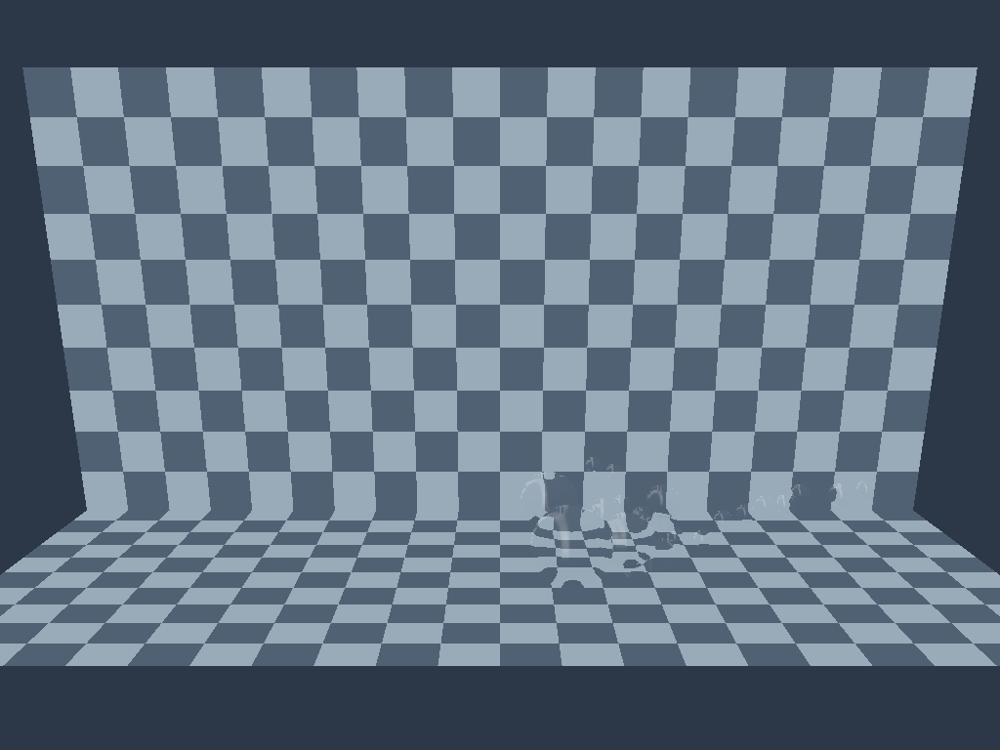
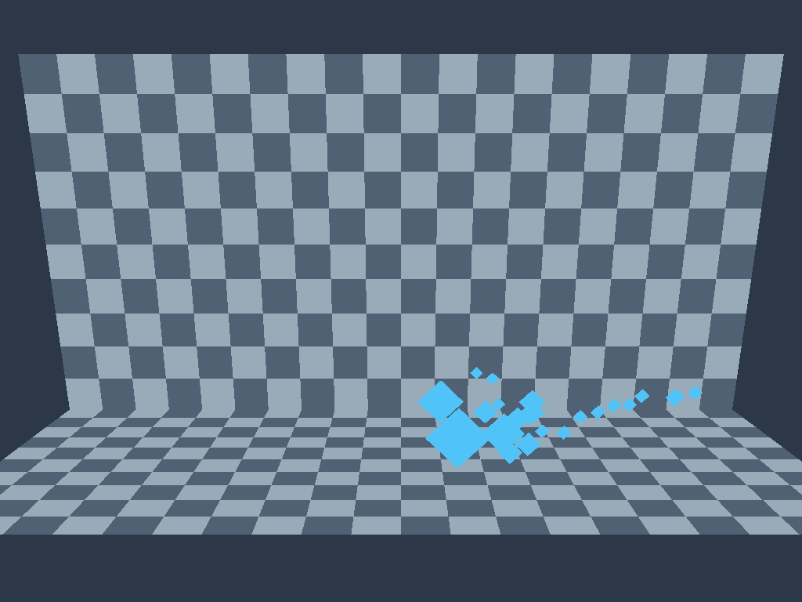
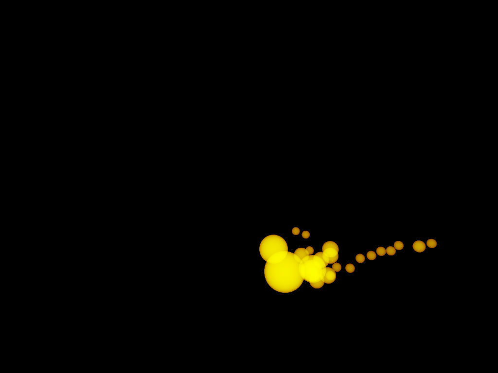
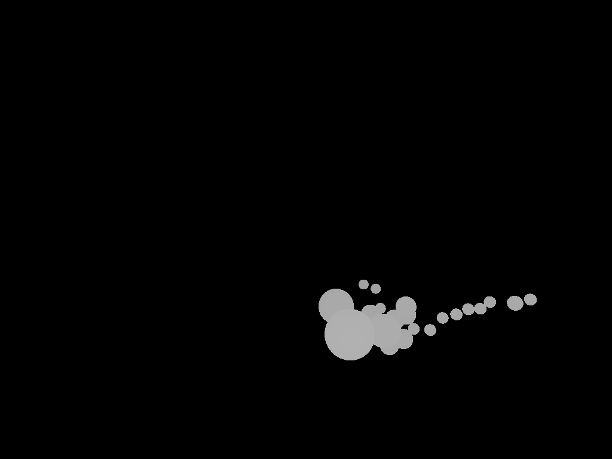

# P1: оптика физических капель — 2026-10-02

Добавлен самостоятельный `ScreenSpaceFluidRenderer` в `voxy_render`. Он получает снимок частиц и камеру, не вызывает решатель и не меняет массу жидкости. Радиус в демо выводится из `mass / rest_density`; все оси имеют один масштаб 1.1 единицы на метр. Тестовая сцена содержит клетчатые непрозрачные стенки и пол для проверки преломления.

## Что работает

1. Аналитическое пересечение луча с физической сферой: ближайшая глубина, радиус и материал.
2. Отдельная аддитивная толщина в метрах, ограниченная ближней/дальней плоскостями камеры и глубиной непрозрачной сцены.
3. Два разделимых прохода bilateral-сглаживания в двух итерациях. Размер окна зависит от проекции радиуса, диапазон — от радиуса. Пустой силуэт не заполняется.
4. Нормали из реконструированной поверхности, Fresnel от IOR, поглощение Beer–Lambert и экранное преломление с проверкой глубины. Для отражений используется аналитическое студийное окружение.
5. Режимы глубины и толщины, проверка входных данных до записи в GPU, отдельный бюджет частиц. Оконное демо пересоздаёт ресурсы при изменении размеров.

`liquids --impacts` использует новый рендер; `--particles` оставляет прежний показ. Для сравнения кадров `liquid_snapshot --reference` строит непрозрачные восьмигранники из **тех же** центров и радиусов, при том же масштабе, камере и фоне.

## Воспроизведение

```sh
cargo build -p voxy_app --release --example liquids --example liquid_snapshot --features glam/serde
cargo test -p voxy_render --test fluid_optics --features glam/serde
./target/release/examples/liquids --impacts --smoke
./target/release/examples/liquid_snapshot /tmp/water.png --impacts --optical --water-close
./target/release/examples/liquid_snapshot /tmp/reference.png --impacts --reference --water-close
./target/release/examples/liquid_snapshot /tmp/thickness.png --impacts --optical --water-close --thickness
./target/release/examples/liquid_snapshot /tmp/depth.png --impacts --optical --water-close --depth
```

Четыре кадра соответствуют 0, 30, 78 и 120 шагам по 1/120 секунды. Рядом сохраняется `*-active.png` для шага 78. Оптические PNG используют sRGB, чтобы линейная композиция отображалась корректно.

## Проверено

На Apple M4 Max / Metal: сборка release; GPU validation при рендере кадров; оконный прогон 120 представленных кадров; проверка баланса физической жидкости и её захвата плёнкой. GPU-тест проверяет диаметр сферы в метрах, аддитивность двух вкладов, частичное и полное перекрытие плоскостью, пустое состояние, сохранение предыдущего снимка после отклонённого обновления, отсутствие соединения разделённых капель сглаживанием. Кадры результата, сравнения, глубины и толщины просмотрены.

## Ограничения и следующая работа

Это этап оптики свободных капель. Накопленная поверхностная плёнка остаётся в физическом состоянии, но **в новом режиме пока не отрисовывается**: исчезновение свободных капель на последнем кадре не означает потерю их массы. Прежний режим сохраняет показ плёнки.

Narrow-Range ещё не реализован. Экранное преломление — приближение смещения фона, без полного трассирования и данных вне кадра. Отражённая кожа и другие объекты пока не входят в аналитическое окружение. В местах смешения оптика использует материал ближайшей частицы и суммарную толщину всех вкладов: это не послойное решение переноса света разных жидкостей. IOR и поглощение в демо иллюстративны. Частицы могут перекрываться, поэтому интеграл их сфер не является доказательством геометрического объёма или массы.

Нет объединённой глубины жидкости с миром, векторов движения капель и временной реконструкции. API рассчитан на single-sample perspective rendering. Производительность и сходимость ещё не измерены. Следующий этап: прозрачная плёнка из рассчитанной толщины, затем контакт капель с текущей деформированной поверхностью тела. Полный анатомический план этим этапом не закрыт.





